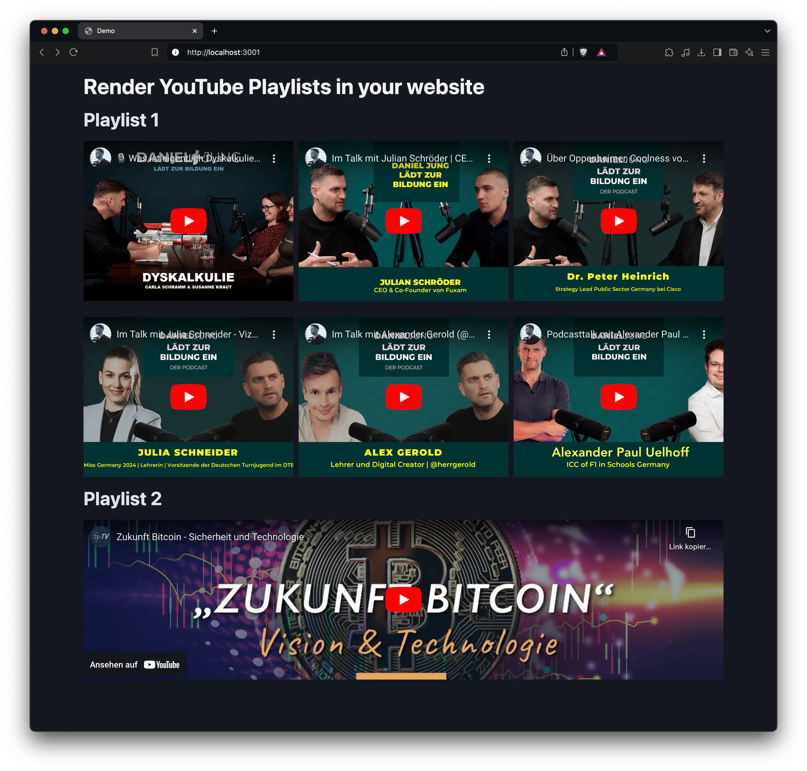

# Render YouTube Playlists in the Browser

Easily bring YouTube playlists to life on your website with this simple script! Just include the JavaScript file directly in your site or load it from an S3 bucket, or any other source.

Check out the [index.html](index.html) file for a quick example of how to get started using the script.

```html
<script src="video-playlist-preview.js" defer></script>
<div
  class="yt-playlist-container"
  data-playlist-id="youtube-playlist-id"
  data-token="your-token"
  data-max-results="optional: select how many videos are being queried"
></div>
```



## Setup

### Get a GoogleApis Token

1. Go to https://console.cloud.google.com/apis/dashboard
2. Select a Project
3. Go to "Credentials"
4. Create a new API Key
5. Set application restrictions, e.g. configure your domains, which should be allowed to use the key.
6. Copy your key (let's say it's `your-token`)
7. Open the JavaScript Developer Console of your browser
8. Run `btoa('your-token')` and copy the output. I know, that's not security at all, but it's just a simple way to obfuscate the token to avoid crawling bots to steal it. We already have the restriction to only allow certain domains to use the token.
9. Use the output as your token in the div-tag.
10. Go to "Enabled APIs & services"
11. Enable the "YouTube Data API v3" for your project: https://console.cloud.google.com/apis/library/youtube.googleapis.com

### Get the Playlist ID

1. Go to your YouTube channel
2. Go to "Playlists"
3. Select the playlist you want to embed
4. Copy the URL, e.g. `https://www.youtube.com/playlist?list=your-playlist-id`
5. Copy the `your-playlist-id` part and use it in the div-tag

### Troubleshooting

If you encounter HTTP 403 Forbidden errors, you might have to enable the YouTube Data API v3 for your project. Go to https://console.cloud.google.com/apis/library/youtube.googleapis.com and enable the API.
